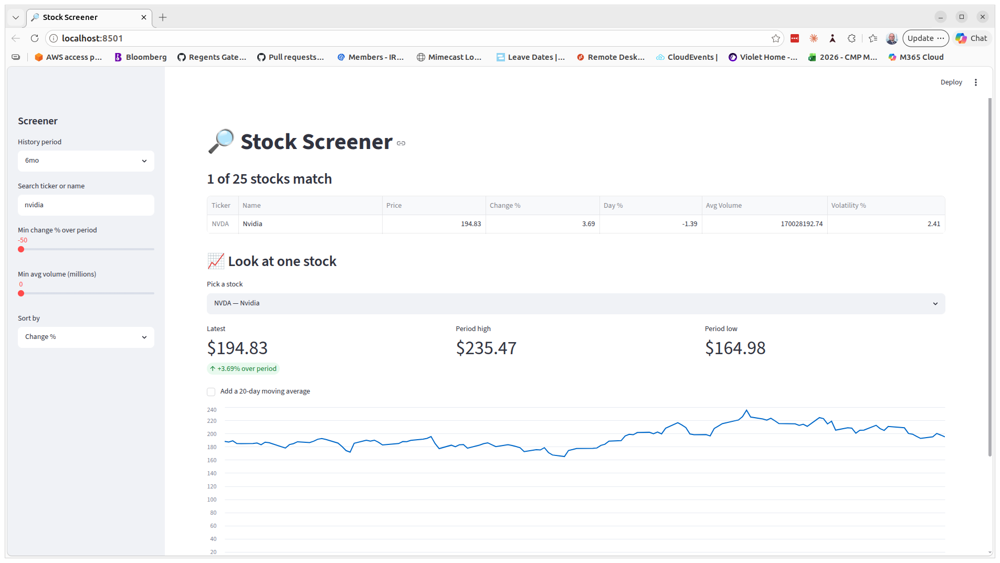

# 🔎 Stock Screener — Work Experience Project

Welcome! You're going to build a **stock screener**: a small web
app that downloads real stock-market data, shows lots of companies at once, and
lets you **search, filter and sort** them to find the interesting ones — then
click into any single stock to see its price chart.

You do **not** need any previous coding experience. Every step is explained, and
this guide is written so you can follow it **on your own** — no teacher required.

> 🎯 **The goal** is a working screener (Stages 1–5 in [SPEC.md](docs/SPEC.md)). It's
> also yours to **keep working on afterwards** — [NEXT-STEPS.md](docs/NEXT-STEPS.md)
> is full of ideas.

---

## What you'll build

A screener that looks something like this:



A screener is really just **filtering and sorting a table** — which happens to be
one of the most useful skills in all of programming.

---

## The tools you'll learn

| Tool | What it is | Why we use it |
| ---- | ---------- | ------------- |
| **Python** | A popular, readable programming language | The language everything is written in |
| **uv** | A tool that installs Python and manages the project | Painless setup — same steps on Windows and Mac |
| **pandas** | A library for tables of data ("DataFrames") | Loads, filters and sorts the stock data |
| **yfinance** | Downloads stock data from Yahoo Finance | Where the real numbers come from |
| **Streamlit** | Turns Python into a web app | Gives you the screener, no web design needed |
| **Jupyter notebooks** | An interactive way to run Python bit by bit | How you'll learn and experiment first |

---

## ⚡ Install `uv` first

Everything here runs through **`uv`** — it installs Python, the packages, and
runs the app for you. Install it once, then never worry about Python versions.

- **🪟 Windows** (open **Windows PowerShell**):

  ```powershell
  powershell -ExecutionPolicy ByPass -c "irm https://astral.sh/uv/install.ps1 | iex"
  ```

- **🍎 macOS / Linux** (open **Terminal**):

  ```bash
  curl -LsSf https://astral.sh/uv/install.sh | sh
  ```

Then **close the terminal, open a new one**, and check it worked:

```bash
uv --version
```

You should see something like `uv 0.10.7`. Full walkthrough and troubleshooting
in **[SETUP.md](docs/SETUP.md)**.

---

## 🚀 How to start (read these in order)

1. **[SETUP.md](docs/SETUP.md)** — install everything and get the app running. **Do this first.** (Just download the project zip and unzip it — no coding tools needed yet.)
2. **[SCHEDULE.md](docs/SCHEDULE.md)** — a suggested order to work through it, so you know what to do when.
3. **[guides/00-welcome.md](guides/00-welcome.md)** — the friendly, step-by-step lessons. Start here to learn.
4. **[SPEC.md](docs/SPEC.md)** — the "job": what your screener should do, stage by stage.
5. **[notebooks/](notebooks/)** — interactive lessons you run and edit yourself.
6. **[reference/](reference/)** — short cheat-sheets to look things up once you're going.
7. **[NEXT-STEPS.md](docs/NEXT-STEPS.md)** — where to take it next.

There are **two learning tracks** — use whichever suits you:

- 📖 **`guides/`** — walks you through everything slowly, assumes zero experience.
- ⚡ **`reference/`** — quick cheat-sheets for when you just need the syntax.

> 🌿 Keep seeing the word **"git"** and wondering what it is? It's optional for
> this project — **[GIT.md](docs/GIT.md)** explains it in plain English if you're
> curious.

---

## Project layout

```
finance-dashboard-workexp/
├── README.md          ← you are here
├── docs/              ← all the project docs
│   ├── SETUP.md       ← install & run (start here)
│   ├── GIT.md         ← optional: what "git" means (you don't need it)
│   ├── SCHEDULE.md    ← a suggested order to work through it
│   ├── SPEC.md        ← what to build, stage by stage
│   └── NEXT-STEPS.md  ← ideas for afterwards
├── app.py             ← the screener you'll grow (starts as a skeleton)
├── pyproject.toml     ← the list of packages the project needs
├── guides/            ← step-by-step lessons
├── reference/         ← short cheat-sheets
├── notebooks/         ← interactive Jupyter lessons
└── data/              ← a place to save data you download
```

> 💡 A complete, working version lives on the **`solution`** branch
> (`git switch solution`). The `main` branch is deliberately a skeleton so you
> build it up yourself. Try first, then compare.

---

## Stuck? (there are no teachers here — and that's fine)

Being stuck and then un-stuck is what coding *is*. When something breaks, try in order:

1. **Read the error message slowly.** It usually says what's wrong and on which line.
2. **Search the exact error text** online (copy-paste it). Someone has hit it before.
3. **Check the matching cheat-sheet** in [`reference/`](reference/).
4. **Peek at the answer** on the `solution` branch: `git switch solution`, look at
   `app.py`, then `git switch main` to go back to your version.

Good luck — have fun with it. 🎉
